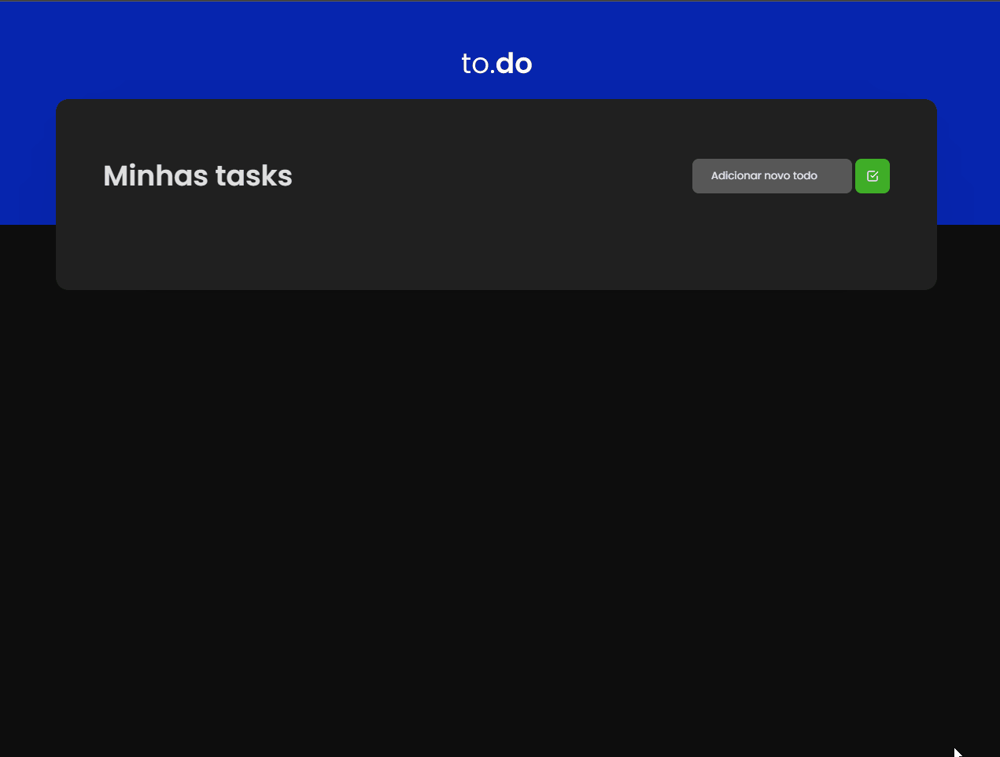

# Task List

<p align="center">Esse projeto é uma aplicação de listagem de tarefas.</p>

<p align="center">
 <a href="#features">Features</a> •
 <a href="#pré-requisitos">Pré Requisitos</a> • 
 <a href="#🎲-rodando-o-front-end">Rodando a aplicação</a> • 
 <a href="#🛠-tecnologias">Tecnologias</a> • 
 <a href="#autor">Autor</a>
</p>

---

<br>


<h1 align="center">
  
</h1>


### Features

- [x] Adicionar uma nova tarefa, limpando o input.
- [x] Remover uma tarefa
- [x] Marcar e desmarcar uma tarefa como concluída

### Pré-requisitos

Antes de começar, você vai precisar ter instalado em sua máquina as seguintes ferramentas:
[Git](https://git-scm.com), [Node.js](https://nodejs.org/en/). 
Além disto é bom ter um editor para trabalhar com o código como [VSCode](https://code.visualstudio.com/)


### 🎲 Rodando o Front End

```bash
# Clone este repositório
$ git clone https://github.com/ARTHURPC03/TaskList

# Acesse a pasta do projeto no terminal/cmd
$ cd TaskList

# Instale as dependências
$ yarn

# Execute a aplicação em modo de desenvolvimento
$ yarn dev

# O servidor iniciará na porta:8080 - acesse <http://localhost:8080>
```


### 🛠 Tecnologias

As seguintes ferramentas foram usadas na construção do projeto:

- [TypeScript](https://www.typescriptlang.org/)
- [React](https://pt-br.reactjs.org/)
- [Sass](https://sass-lang.com/)

---

### Autor


  
Made with 💜 by ARTHUR PC 👋 

[](https://www.linkedin.com/in/arthurpc03/) 
[](https://www.youtube.com/arthurpc) 


